# Features

## Access to pages according to the user role:

| Page Name | Logged out  | User | Admin |
| --------- | ----------- |------- | ----- |
| Home      | Yes         | No        | No     
| Create Road Sign   | Yes        | No        | No 
| Update Road Sign   | Yes        | No        | No      
| Delete Road Sign   | Yes        | No        | No 
| Create Trafic Rule | Yes        | No        | No        
| Update Trafic Rule | Yes        | No        | No 
| Delete Trafic Rule | Yes        | No        | No 
| Quiz Page          | Yes        | No        | No 
| Trafic Rules Page  | Yes        | No        | No 
| Road Signs Page    | Yes        | No        | No 
| Home               | No         | Yes       | Yes     
| Create Road Sign   | No         | No        | Yes 
| Update Road Sign   | No         | No        | Yes      
| Delete Road Sign   | No         | No        | Yes 
| Create Trafic Rule | No         | No        | Yes
| Update Trafic Rule | No         | No        | Yes 
| Delete Trafic Rule | No         | No        | Yes 
| Quiz Page          | No         | Yes       | Yes 
| Trafic Rules Page  | No         | Yes       | Yes 
| Road Signs Page    | No         | Yes      | Yes 

## Main Features:

- Each page has a navbar and a footer

### Navbar:

- ##### Navigation

  - Contains navigation links :
    - HOME - leads to the home page.
    - Log in/out - leads to the login page.
    - Trafic Rules - leads to the trafic rules page.
    - Road Signs - leads to the road sign page
  - The links have animated hover effect.
  - The navigation is clear and easy to understand for the user.
    

  - The navigation bar is responsive:

    - On mobile devices:

      - navigation bar filled with the logo in the center and a hamburger menu implemented on the right side of the navigation bar.  
        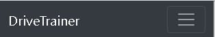

      - When the hamburger menu is clicked, there is dropdown menu with the links in the same order.
        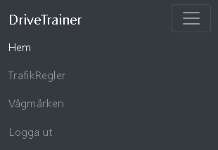

### Home page:

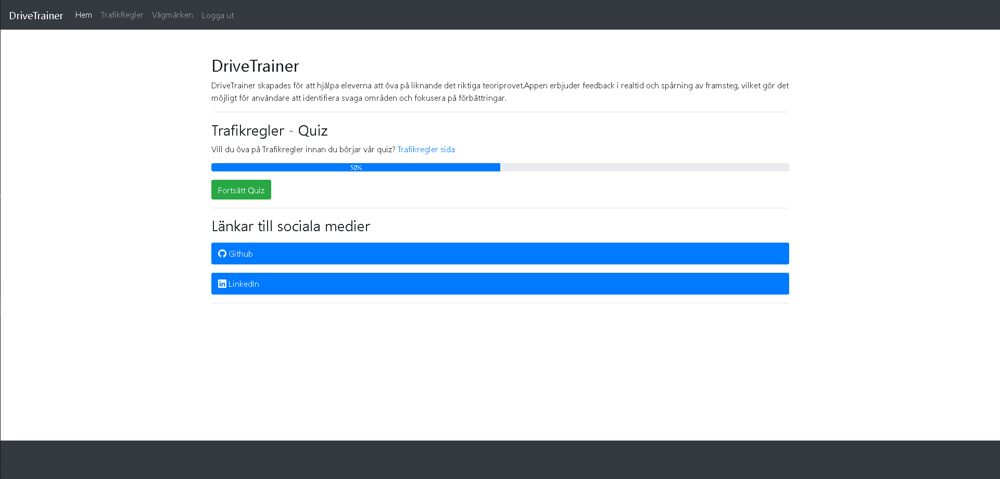

The home page has:

- Details section:

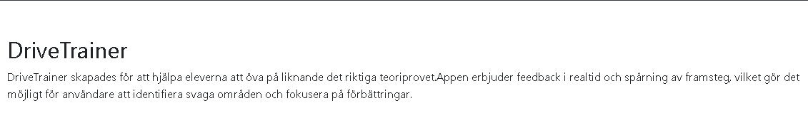

This sections explains the purpose with the website, Which is to train for driving theory exam.

- Quiz section:

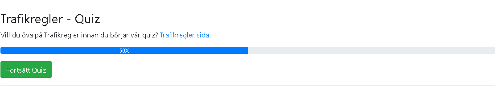

This sections has a progress bar that keeps track of user progression through the quiz. A button to start or continue the quiz.

- Social Media section:

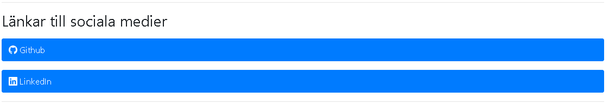

This sections has a buttons that leads to the socials platforms.

### Trafic Rules page:

The trafic rules page has : 

- Cards :

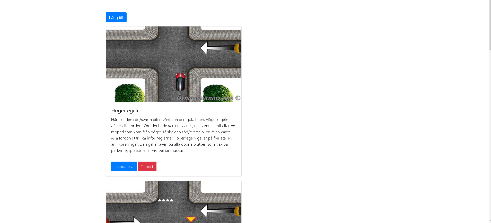

This page contains cards that contains different rules in different cards which is the main content of the page.

- Buttons to Delete or Update a card:

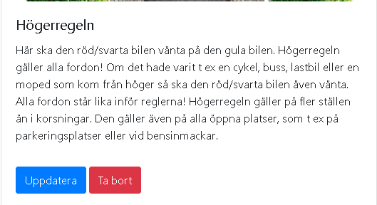

The functionality to update, delete is only limited for the admin users.

- Add Button to  add a new card:

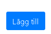

The functionality to Add is only limited for the admin users.

- Pagination:

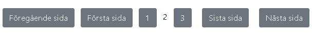

The pagination allows the users to navigate through the content easily.

### Road Signs page:

The road signs page has : 

- Cards :

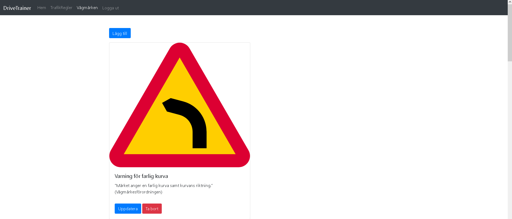

This page contains cards that contains different rules in different cards which is the main content of the page.

- Buttons to Delete or Update a card:

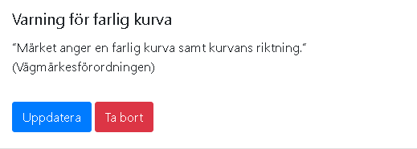

The functionality to update, delete is only limited for the admin users.

- Add Button to  add a new card:

The functionality to Add is only limited for the admin users.

- Pagination:

The pagination allows the users to navigate through the content easily.

### Quiz page:

The home page has:

- Questions for the quiz:

The questions are made of title and picture and radio buttons that are the choices. Submit button once the user tries to submit the answer.

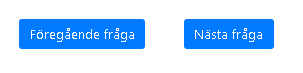

The pagination allows the users to navigate through the questions easily.

### Create Trafic Rule page:

The create traic rule page has:

- Create Form:

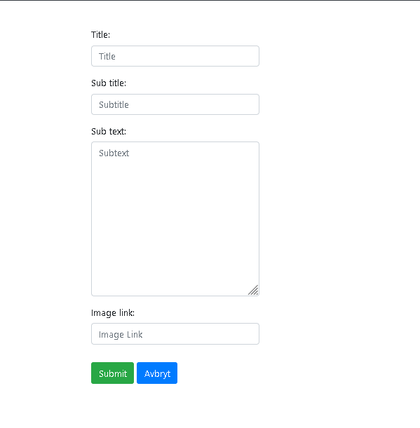

The form is only accessible to admin users. The page allows the users to create a new trafic rule.

### Update Trafic Rule page:

The update traic rule page has:

- Update Form:

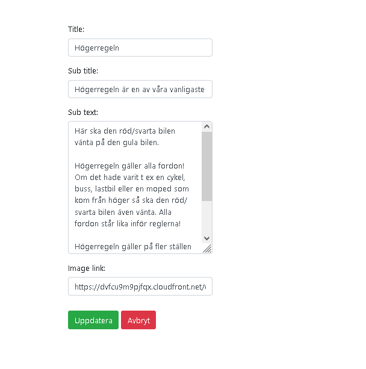

The form is only accessible to admin users. The page allows the users to update an existing trafic rule.

### Delete Trafic Rule page:

The delete traic rule page has:

- Delete Page:

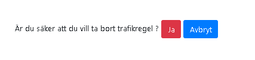

The page is only accessible to admin users. The page allows the users to delete an existing trafic rule.

### Add Road Sign page:

The add road sign page has:

- Add form:

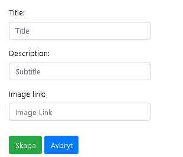

The page is only accessible to admin users. The page allows the users to create a new road sign.

### Update Road Sign page:

The update road sign page has:

- Update form:

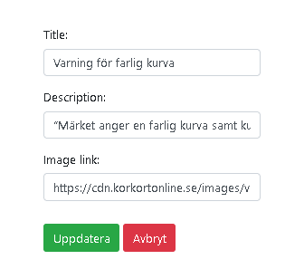

The page is only accessible to admin users. The page allows the users to update an existing road sign.

### Delete Road Sign page:

The delete road sign page has:

- Delete Page:

The page is only accessible to admin users. The page allows the users to delete an existing road sign.