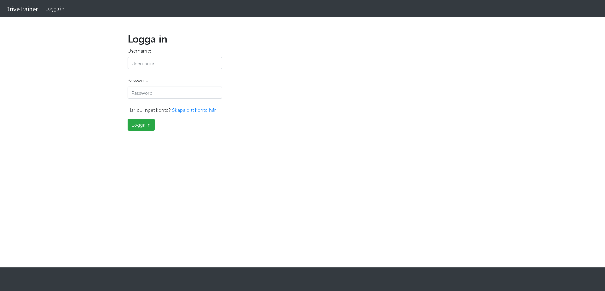
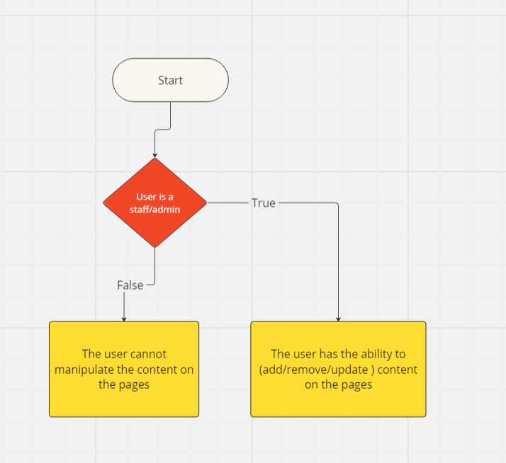
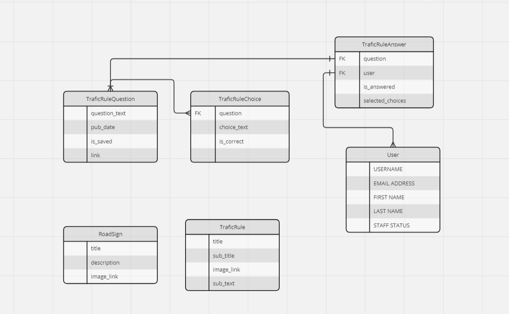

# DriveReady

**Deployed website: [Link to website](https://driveready.onrender.com/)**

## About

DriveReady is a website that allows user to learn about various roadsigns and traficRules. It has a login system, a quiz for the user to train. The main functionality of Adding,Updating,Deleting is purposed only for "Administrators/staff". Every person with the administrator privilage can do the "CRUD" operations. The site uses pictures from another webpage, in case the images does not render in the futures it should be due an error with the links. 

---

## UX

### Target Audience

This website is intended for people interested in learning how to drive a car. starting from Trafic Rules, Trafic Signs. This website is easy to use and navigate. 

### User Stories

#### First Time Visitor

- As a First Time Visitor, I want to easily understand the main purpose of the site.
- As a First Time Visitor, I want to be able to easily navigate through the website, so I can find the content.
- As a First Time Visitor, I want to be able to register an account.
- As a First Time Visitor, I want to be able to login

### Returning VisitorGoals:

- As a Returning Visitor, I want to see more content, so that I can prepare more for the exam.

---

## Future Development

#### Update Styles of the page

The styles was not a huge focus because the app is a static webpage. In the future i should focus on updating the styles.

#### Ability to search through the content

This feature allows the user to filter through the content by making a search.

#### Hosting Pictures

The feature is intended to host pictures instead of using pictures from a different page.

---

## Technologies used
- ### Languages:
    
    + [Python 3.8.5](https://www.python.org/downloads/release/python-385/): the primary language used to develop the server-side of the website.
    + [HTML](https://developer.mozilla.org/en-US/docs/Web/HTML): the markup language used to create the website.
    + [BOOTSTRAP](https://getbootstrap.com/): the styling used to style the elements of the website.

- ### Frameworks and libraries:

    + [Django](https://www.djangoproject.com/): python framework used to create all the logic.

- ### Databases:

    + [SQLite](https://www.sqlite.org/): was used as a development database.
    + [PostgreSQL](https://www.postgresql.org/): the database used to store all the data.

- ### Other tools:

    + [Git](https://git-scm.com/): the version control system used to manage the code.
    + [Pip3](https://pypi.org/project/pip/): the package manager used to install the dependencies.
    + [Gunicorn](https://gunicorn.org/): the web server used to run the website.
    + [Psycopg2](https://www.psycopg.org/): the database driver used to connect to the database.
    + [Django-allauth](https://django-allauth.readthedocs.io/en/latest/): the authentication library used to create the user accounts.
    + [GitHub](https://github.com/): used to host the website's source code.
    + [VSCode](https://code.visualstudio.com/): the IDE used to develop the website.
    + [Chrome DevTools](https://developer.chrome.com/docs/devtools/open/): was used to debug the website.
    + [W3C Validator](https://validator.w3.org/): was used to validate HTML5 code for the website.
    + [W3C CSS validator](https://jigsaw.w3.org/css-validator/): was used to validate CSS code for the website.
    + [PEP8](https://pep8.org/): was used to validate Python code for the website.
    + [Miro](https://miro.com/) was used to create a Entity-Relationship Diagram and flowcharts.

---

## Features

Please refer to the [FEATURES.md](FEATURES.md) file for all test-related documentation.

---
## Design

### Wireframes

    [Wireframes](documentation/design/wireframes.pdf)

  

---

## Flowcharts
To understand CRUD concept, I created several a flowchart diagram.

1. Ability to preform CRUD (Create, Read , Update , Delete) functionalty for staff/admin users

---

## Information Architecture

### Database

* During the earliest stages of the project, the database was created using SQLite.
* The database was then migrated to PostgreSQL.

### Entity-Relationship Diagram

### Data Modeling

#### Trafic Rule Question Model
| Name          | Database Key  | Field Type    | Validation |
| ------------- | ------------- | ------------- | ---------- |
| question_text          | question_text          | CharField    | max_length=500 |
| pub_date   | pub_date   | DateTimeField    |  |
| is_saved   | is_saved   | BooleanField    |  |
| link   | link   | CharField    | max_length=500 |

#### Trafic Rule Choice Model
| Name          | Database Key  | Field Type    | Validation |
| ------------- | ------------- | ------------- | ---------- |
| question      | question      | ForeignKey    |            |
| choice_text   | choice_text   | CharField     | max_length=400|
| is_correct    | is_correct    | BooleanField  |            |

#### Trafic Rule Answer Model
| Name          | Database Key  | Field Type    | Validation |
| ------------- | ------------- | ------------- | ---------- |
| question      | question      | ForeignKey    |            |
| user          | user          | ForeignKey    |            |
| selected_choices    | selected_choices    | ManyToManyField  |            |
| is_answered          | is_answered          | BooleanField    |            |

#### Trafic Rule Model
| Name          | Database Key  | Field Type    | Validation |
| ------------- | ------------- | ------------- | ---------- |
| title         | title         | CharField     | max_length=400 |
| sub_title          | sub_title          | CharField    |   max_length=400    |
| sub_text    | sub_text    | TextField  |     max_length=500       |
| image_link          | image_link          | CharField    |    max_length=500        |

#### Road Sign Model
| Name          | Database Key  | Field Type    | Validation |
| ------------- | ------------- | ------------- | ---------- |
| title         | title         | CharField     | max_length=400 |
| description          | description          | TextField    |   max_length=800    |
| image_link          | image_link          | CharField    |    max_length=500        |

---
## Testing

Please refer to the [TESTING.md](TESTING.md) file for all test-related documentation.

---

## Deployment and Payment setup

- The app was deployed to [Render](https://render.com/).
- The database was deployed to [ElephantSQL](https://www.elephantsql.com/).

- The app can be reached by the [link](https://wowder.onrender.com).

Please refer to the [DEPLOYMENT.md](DEPLOYMENT.md) file for all deployment.

---

## Credits

### Content and Images

- [övningskörning](https://www.xn--vningskrning-3ibh.com/): for images usage.
- [chrome developer tools](https://developer.chrome.com/extensions/devtools_inspector): for providing a free platform to test website.

---

## Acknowledgments

[codeinstitute](https://codeinstitute.net/se/)
I am thankful to Code Institue for providing the template for the project to use!