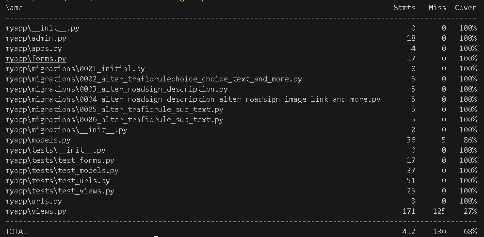

# TESTING

## Manual Testing

Testing was done throughout site development, for each feature before it was merged into the master file.

Usability was tested with the below user acceptance testing, sent to new users to ensure testing from different users, on different devices and browsers to ensure issues were caught and where possible fixed during development.


| Page    | User Actions           | Expected Results | Y/N | Comments    |
|-------------|------------------------|------------------|------|-------------|
| Sign Up     |                        |                  |      |             |
| 1           | Click on Sign Up button | Redirection to Sign Up page | Y |          |
| 2           | Click on the Login link | Redirection to Login page | Y |          |
| 3           | Enter valid email 2 times | Field will only accept email address format | Y |          |
| 4           | Enter valid password 2 times | Field will only accept password format | Y |          |
| 5           | Sign In | Redirects user to home page | Y |          |
| 9           | Click "Logout" button | Redirects user to login page | Y |          |
| 10          | Click browser back button | You are still logged out | Y |          |
| Log In      |                        |                  |      |             |
| 1           | Click on Log In button | Redirection to Log In page | Y |          |
| 2           | Click on the Sign Up link in the form | Redirection to Sign Up page | Y |          |
| 3           | Enter valid email | Field will only accept email address format | Y |          |
| 4           | Enter valid password | Field will only accept password format | Y |          |
| 5           | click login button with valid form | Redirects user to home page | Y |          |
| 6           | click logout button | Redirects user to login page | Y |          |
| 7           | Click browser back button | You are still logged out | Y |          |
| 8           | Enter valid email | Field will only accept email address format | Y |          |
| 9         | Enter valid password | Field will only accept password format | Y |          |
| Navigation  |                        |                  |      |             |
| 1           | Click on the logo | Redirection to home page | Y |          |
| 2           | Click TrafikRegler (trafic_rules) in the navbar | Redirection to trafic_rules page | Y |          |
| 3           | Click Vägmärken (roadi_signs) | Redirection to roadi_signs page | Y |          |
| 4           | Click Start Quiz/Continue Quiz | Redirection to question-detail page | Y |          |
| 5           | Click Github button | Redirection to new tab with github link | Y |          |
| 6           | Click LinkedIn button | Redirection to new tab with linkedIn link | Y |          |
| 7           | Click Logout button | Redirection to login page | Y |          |
| Admin Navigation |                        |                  |      |             |
| 1           | Click Update trafic rule | Redirection to update form with fields filleld in | Y |          |
| 2           | Click on Delete button | Redirection to confirmation page | Y |          |
| 3           | Click on Delete in confirmation page | Redirection to previous page on the first page | Y |          |
| 4           | Click Add button | Redirection to page with form to fill out | Y |          |
| 5           | Click Submit in create page with form filled | Redirection to page with new item created | Y |          |
| 6           | Click Cancel in page | Redirection to previous page | Y |          |


---

## Automated testing

### Django unit testing

At the very beginning of the project, I decided to use Django's built-in unit testing framework. Thus, all tests are created simultaneously with the code.

I am running the following testing commands in my terminal to test the code:

```
python3 manage.py test <name of the app>
```

To create the coverage report, I run the following command:

```
coverage run --source=<name of the app> manage.py test
```

```
coverage report
```

**app:**



---

## Bugs

**Solved bugs:**
1. I was getting a server error when trying to access the create road sign form in production.

*Solution:*

Corrected the template name in the view to match the name of the .html file while being case sensitive .

2. I was not being able to delete anything such as Trafic Rule or Road Sign

*Solution:*

I changed in the template from `<input type="button">` to `<input type="submit">`.

**Unsolved bugs:**

- Some pages did not pass through the official [W3C](https://validator.w3.org/) such as Sign-up and Question-detail 

## Validation

### HTML Validation:
- No errors or warnings were found when passing through the official [W3C](https://validator.w3.org/) validator. This checking was done manually by copying the view page source code (Ctrl+U) and pasting it into the validator.

- [App HTML validation report](documentation/validation/html.pdf)

### Python Validation:

- No errors were found when the code was passed through Valentin Bryukhanov's [online validation tool](http://pep8online.com/). According to the reports, the code is [Pep 8-compliant](https://legacy.python.org/dev/peps/pep-0008/). This checking was done manually by copying python code and pasting it into the validator.

- [App validation report](documentation/validation/python.pdf)

---
## Lighthouse Report

LightHouse is a web performance testing tool that can be used to evaluate the performance of a website. The report is generated by Google Chrome.

[Lighthouse Report](documentation/testing/lighthouse_report.pdf)

- Lighthouse Reports Could not be generated for pages because of restrictions for inlogged users only


---
## Responsiveness

The responsiveness was checked manually by using devtools (Chrome) throughout the whole development. It was also checked with [Responsive Viewer](https://chrome.google.com/webstore/detail/responsive-viewer/inmopeiepgfljkpkidclfgbgbmfcennb/related?hl=en) Chrome extension.

[Responsiveness Report](documentation/testing/responsiveness.pdf)

---